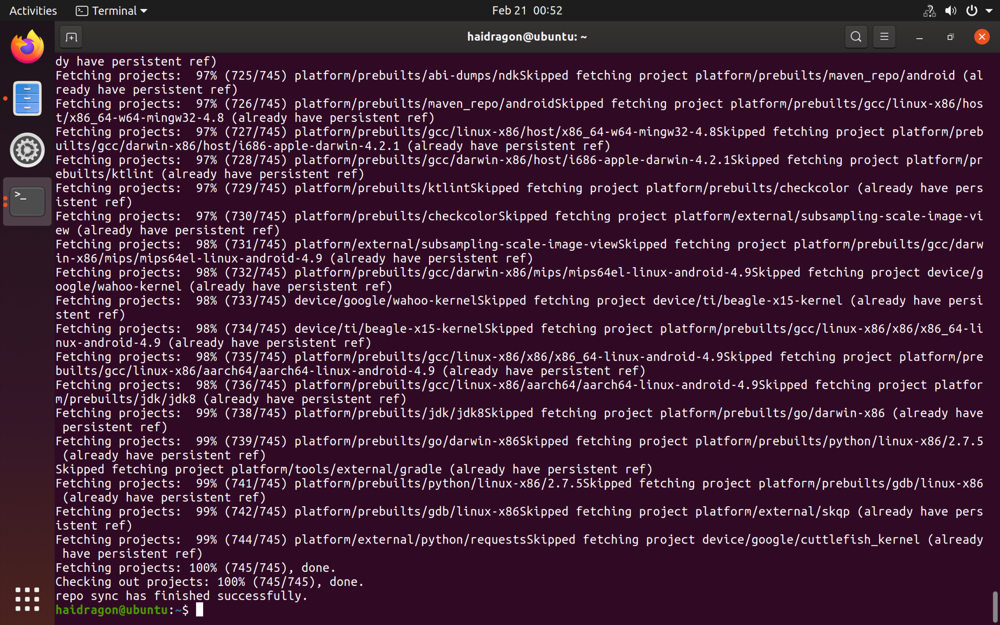
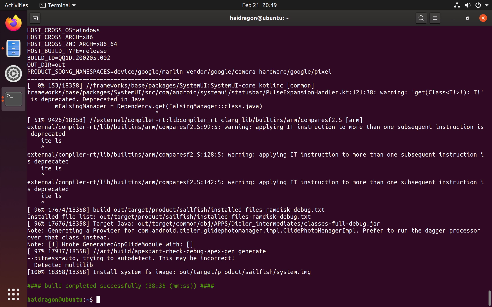
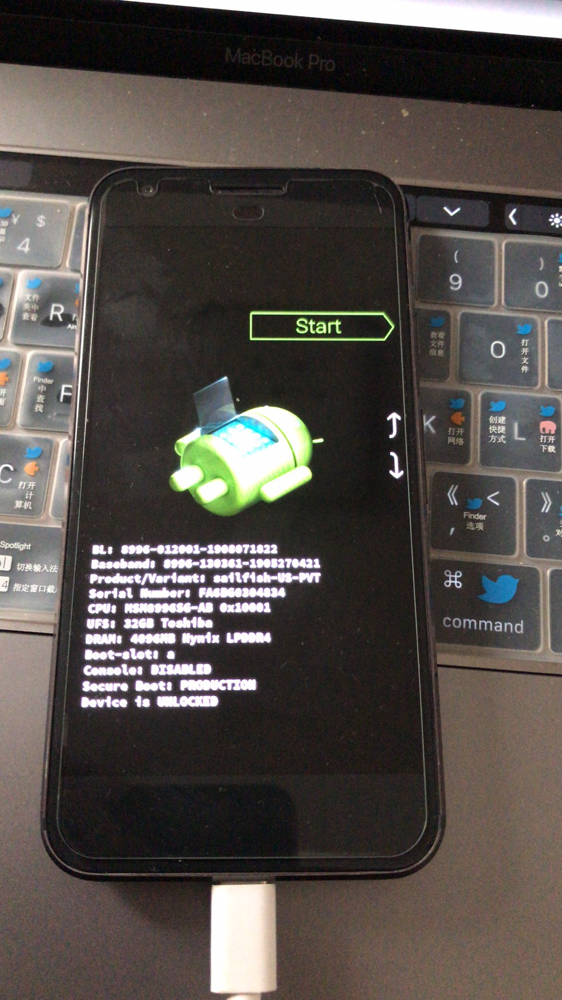
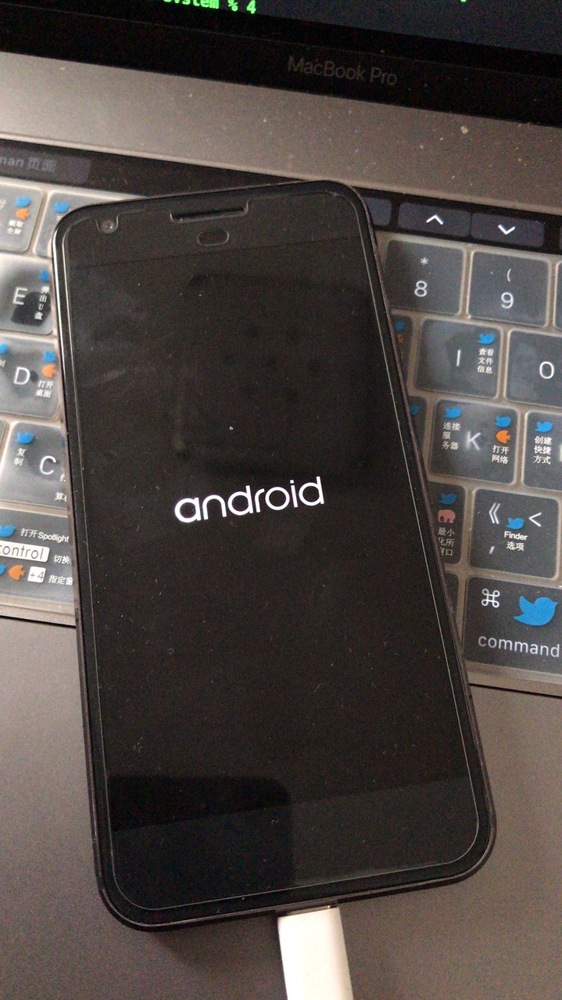
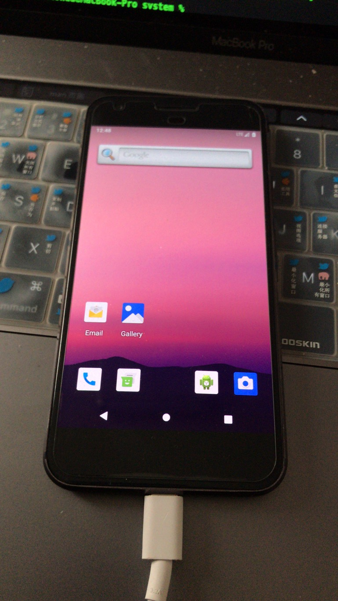
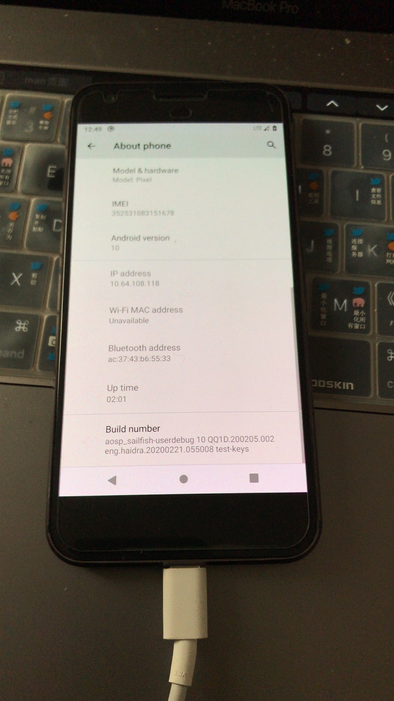

# android 10版本源码编译与Pixel刷机

## [先下载android 10 源码](https://mirrors.tuna.tsinghua.edu.cn/help/AOSP/)

* 下载 repo工具

sudo apt-get install git

接下来创建bin，（可以加入到PATH中）

~: mkdir bin

下载 repo 设置权限

curl https://mirrors.tuna.tsinghua.edu.cn/git/git-repo > ~/bin/repo

设置从镜像中下载（tuna的镜像源）

export REPO_URL='https://mirrors.tuna.tsinghua.edu.cn/git/git-repo/'

设置身份，添加自己的邮箱和姓名:

git config --global user.email "piratemorgen@gmail.com" 

git config --global user.name "piratemorgen"

初始化

~/bin/repo init -u https://aosp.tuna.tsinghua.edu.cn/platform/manifest

指定版本

~/bin/repo init -u https://aosp.tuna.tsinghua.edu.cn/platform/manifest -b android-10.0.0_r29   (可能没提示，直接同步就行)

同步

~/bin/repo sync -j10


## 编译源码
apt install p7zip    7zr x android9.0.7z -r -o./

[7za](https://blog.csdn.net/qq_27608983/article/details/92462659) a -v4g android-10.0.0_r29.7z ~/ 

7za x  android-10.0.0_r29.7z  -r -o./(-o后是没有空格的，直接接目录。这一点需要注意)

* 安装依赖项

```
sudo apt-get install -y libx11-dev libreadline6-dev:i386 libgl1-mesa-dev g++-multilib
sudo apt-get install -y git flex bison gperf build-essential libncurses5  libxml2-utils
sudo apt-get install -y tofrodos python-markdown libxml2-utils xsltproc zlib1g-dev:i386
sudo apt-get install -y dpkg-dev libsdl1.2-dev libesd0-dev  curl  
sudo apt-get install -y lib32z-dev ccache libssl-dev
```


```
  34  7z
   35  sudo apt install p7zip-full
   36  ls
   37  cd De
   38  cd Dre
   39  cd Desktop/
   40  ls
   41  7za x android-10.0.0_r29.7z -r -o./
   42  7za x android-10.0.0_r29.7z.001 -r -o./
   43  ls
   44  cd haidragon/
   45  ls
   46  pwd
   47  ls
   48  cd ..
   49  ls
   50  rm -rf android-10.0.0_r29.7z.00*
   51  ls
   52  cd haidragon/
   53  ls
   54  export CLASSPATH='/home/haidragon/Desktop/jdk8/java-8-openjdk-amd64/lib' 
   55  ls
   56  cd ..
   57  ls
   58  export JAVA_HOME='/home/haidragon/Desktop/jdk8/java-8-openjdk-amd64'
   59  export PATH=$PATH:'/home/haidragon/Desktop/jdk8/java-8-openjdk-amd64/bin' 
   60  sudo apt install curl
   61  apt install  libxml2-utils
   62  sudo apt install  libxml2-utils
   63  sudo apt install libncurses5 
   64  ls
   65  source build/envsetup.sh
   66  cd haidragon/
   67  source build/envsetup.sh
   68  ls
   69  cd build/
   70  ls
   71  chmod 777 ./envsetup.sh 
   72  ./envsetup.sh 
   73  cd ..
   74  ls
   75  lunch 
   76  export JACK_SERVER_VM_ARGUMENTS="-Dfile.encoding=UTF-8 -XX:+TieredCompilation -Xmx8g"
   77  ./prebuilts/sdk/tools/jack-admin start-server
   78  ls
   79  cd prebuilts/
   80  ls
   81  cd sdk/
   82  ls
   83  cd tools/
   84  ls
   85  cd li
   86  cd linux/
   87  ls
   88  cd ..
   89  ls
   90  sudo apt-get install -y libx11-dev:i386 libreadline6-dev:i386 libgl1-mesa-dev g++-multilib
   91  sudo apt-get install -y git flex bison gperf build-essential libncurses5-dev:i386
   92  sudo apt-get install -y tofrodos python-markdown libxml2-utils xsltproc zlib1g-dev:i386
   93  sudo apt-get install -y dpkg-dev libsdl1.2-dev libesd0-dev
   94  sudo apt-get install -y dpkg-dev libsdl1.2-dev 
   95  sudo apt-get install -y git-core gnupg flex bison gperf build-essential
   96  sudo apt-get install -y  gnupg flex bison gperf build-essential
   97  sudo apt-get install -y  gnupg  build-essential
   98  sudo apt-get install -y    build-essential
   99  sudo apt-get install -y zip curl zlib1g-dev gcc-multilib g++-multilib
  100  sudo apt-get install -y  curl 
  101  sudo apt-get install -y libc6-dev-i386
  102  sudo apt-get install -y   x11proto-core-dev 
  103  sudo apt-get install -y libgl1-mesa-dev libxml2-utils xsltproc unzip m4
  104  sudo apt-get install -y lib32z-dev ccache
  105  sudo apt-get install -y libssl-dev
  106  cd ../../../
  107  ls
  108  ./extract-google_devices-sailfish.sh 
  109  ./extract-qcom-sailfish.sh 
  110  ls
  111  lunch 
  112  export LC_ALL=C 
  113  history 
  114 make update-api -j10
  115 make -j10
```
## 与前面系统不同的地方 （第一次编译最好用一个线程 容易发现问题)

增加
```
make android.test.mock.docs-update-current-api
make api-stubs-docs-update-current-api
```


# 刷入 
```
export PATH=$PATH:/Users/haidragon/Library/Android/sdk/platform-tools
adb devices
export ANDROID_PRODUCT_OUT=./
echo $ANDROID_PRODUCT_OUT
adb reboot bootloader
fastboot flashall -w
```





